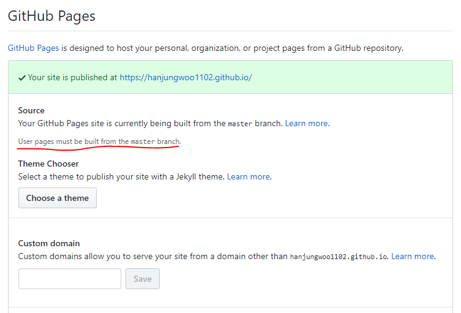

# 준비

gatsby 를 깔고 개발 환경 세팅과 gh-pages 를 이용한 배포 까지의 준비과정을 정리해 봤다.

---

## Install Gatsby

node js, npm, git 은 깔려 있었고 gatsby 만 설치하면 됐다.

```
npm install -g gatsby-cli
```

---

## Gatsby Library

[Gatsby Library](https://www.gatsbyjs.org/starters/?v=2) 에 가보면 다른 사람들이 만들어 놓은 여러 템플릿?? 테마?? 가 존재한다. 이 중에서 나는 내가 원하는 기능을 가지고 있고 디자인 마음에 드는 블로그를 찾아봤다. 하지만 발견하지 못했고 그래서 그냥 처음부터 내가 만들자!! 라는 생각으로 가장 기초 테마로 (hello world 만 쓰여있는) 시작하기로 했다.

```
gatsby new hello-world https://github.com/gatsbyjs/gatsby-starter-hello-world
```

그리고 잘 되나 돌려보기 위해 개발 환경으로 돌려보기로 했다.

```
gatsby develop
```

http://localhost:8000/ 에서 확인해본 결과 hello world 만 떠있는 빈 페이지가 잘 나왔다.

---

## Github 배포

보통 Gatsby 블로그는 Netlify 로 배포한다고 한다. 하지만 나는 다른 곳에서 호스팅 하기를 원하지 않았다. 그래서 찾아보댜가 gh-pages 란 것을 알게 됐다.

1. gh-pages 설치

```
npm install gh-pages --save-dev
```

2. package.json 에 deploy 를 위한 스크립트 추가

```
script: {
    ...
    "deploy": "gatsby build && gh-pages -d public -b master",
}
```

3. 배포 해보기

```
npm run deploy
```

* master 말고 다른 브랜치에 배포해서 사용하고 싶었지만 user page 일 경우 master 에 빌드 돼야 한다고 한다. hanjungwoo1102.github.io 에 배포하고 싶어서 나는 그냥 master 에 배포하기로 했다. (다른 프로젝트에서 배포하면 hanjunggwoo1102.github.io/other-project-name/ 으로 배포가 되고 그 떄는 다른 브랜치에 배포할 수 있다고 알고 있다.)
